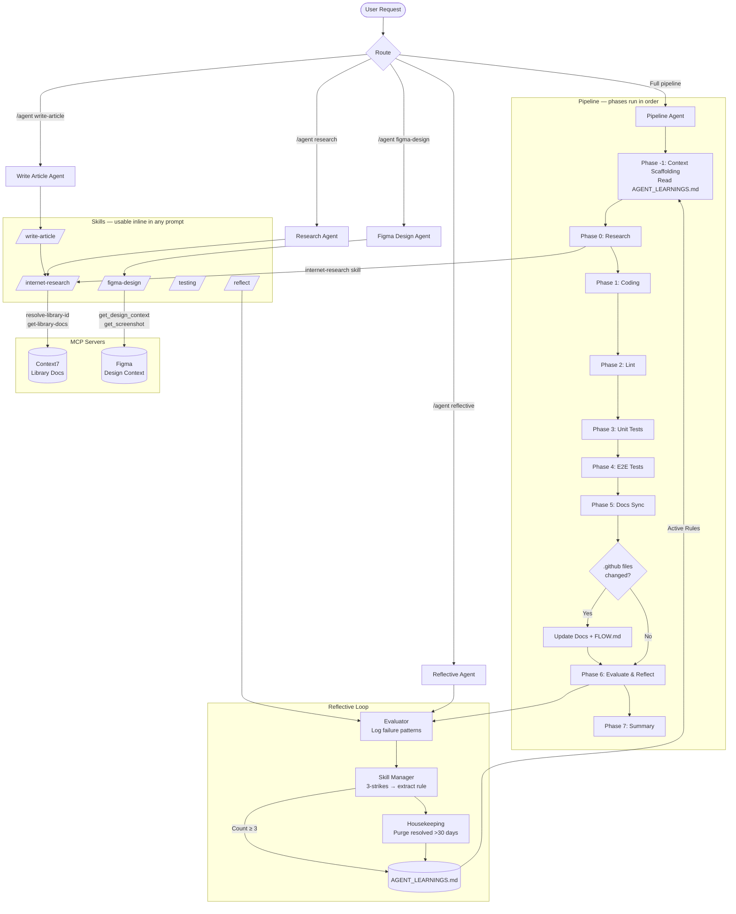

# .github Agentic Workflow

This folder contains agent definitions, skills, and instruction files used by Copilot in this repository.

## Pipeline Flow

## Skills

Skills provide specialized, reusable capabilities invokable inline (`/skill-name`) or called by agents.

| Skill               | File                                | MCP Dependency                   | Purpose                                            |
| ------------------- | ----------------------------------- | -------------------------------- | -------------------------------------------------- |
| `internet-research` | `skills/internet-research/SKILL.md` | Context7                         | Fetch live library docs before coding              |
| `figma-design`      | `skills/figma-design/SKILL.md`      | Figma MCP                        | Translate Figma frames to React components         |
| `testing`           | `skills/testing/SKILL.md`           | —                                | Write/fix Jest + RTL tests                         |
| `write-article`     | `skills/write-article/SKILL.md`     | Context7 (via internet-research) | Research and draft technical articles              |
| `reflect`           | `skills/reflect/SKILL.md`           | —                                | Log failures + extract rules to AGENT_LEARNINGS.md |

## MCP Servers

| Server                                                       | Setup                                 | Used By                                                     |
| ------------------------------------------------------------ | ------------------------------------- | ----------------------------------------------------------- |
| **Context7** (`@upstash/context7-mcp`)                       | `npx -y @upstash/context7-mcp`        | `internet-research` skill, Research Agent, Pipeline Phase 0 |
| **Figma MCP** (`mcp.figma.com/mcp` or `figma-developer-mcp`) | OAuth via `https://mcp.figma.com/mcp` | `figma-design` skill, Figma Design Agent                    |

See [copilot-instructions.md](./copilot-instructions.md) for one-time MCP setup instructions.

## Docs Sync Scope

The docs phase (Phase 5) and Docs Agent update documentation when changes are detected in:

- `.github/agents/**`
- `.github/skills/**`
- `.github/instructions/**`
- `.github/prompts/**`
- `src/app/**`
- `src/components/**`
- `src/data/**`
- `src/lib/**`
- `content/**`
- `.github/AGENT_LEARNINGS.md` (when new rules are extracted by the Reflective Agent)

**When new agents, skills, or MCP servers are added**, the docs phase must also:

1. Add a row to the **Skills** or **MCP Servers** table above.
2. Add a node and edge to the **Pipeline Flow** Mermaid diagram.
3. Update the agent/skill inventory in `copilot-instructions.md` if the entry point or invocation pattern changed.

**When structural source folders change**, the docs phase must also:

1. Update the root `README.md` Project Structure section so it reflects the current directory layout.
