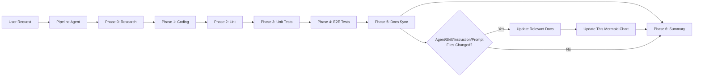

# .github Agentic Workflow

This folder contains agent definitions, skills, and instruction files used by Copilot in this repository.

## Mermaid Flow

## Docs Sync Scope

The docs phase updates documentation when changes are detected in:

- `.github/agents/**`
- `.github/skills/**`
- `.github/instructions/**`
- `.github/prompts/**`

It also refreshes this Mermaid chart when the agentic flow changes.
